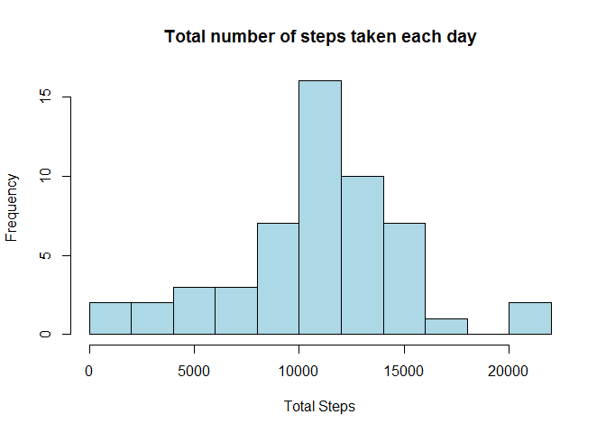

### Prerequisite:  
#### Packages used:

```r
library(dplyr)
library(ggplot2)
```
#### Global option setting:


## Loading and preprocessing the data


```r
# URL <- "https://d396qusza40orc.cloudfront.net/repdata%2Fdata%2Factivity.zip"
# Downloading and unzipping file:
# download.file(URL, destfile = "data.zip")
unzip("activity.zip")
# Reading of Data into a data frames called
activitydata <- read.csv("activity.csv")
```


## Question-1: What is mean total number of steps taken per day?

For this part of the assignment, the missing values in the dataset are ignored.

#### 1. Calculate the total number of steps taken per day
For proper estimation of mean of the total number of steps taken per day,  
na.rm is made FALSE in order to ignore those days when no data is collected


```r
totalsteps <- with(activitydata, tapply(steps, date, sum, na.rm = FALSE))
```

#### 2. Make a histogram of the total number of steps taken each day

```r
hist(totalsteps, breaks = 10, col = "lightblue", xlab = "Total Steps", 
     main = "Total number of steps taken each day")  
```

<!-- -->
  
#### 3. Calculate and report the mean and median of the total number of steps taken per day  
Mean of the total number of steps taken per day:

```r
mean_withNA <- mean(totalsteps, na.rm = TRUE)
print(mean_withNA)
```

```
## [1] 10766.19
```
Median of the total number of steps taken per day:

```r
median_withNA <- median(totalsteps, na.rm = TRUE)
print(median_withNA)
```

```
## [1] 10765
```

## What is the average daily activity pattern?


## Imputing missing values


## Are there differences in activity patterns between weekdays and weekends?
